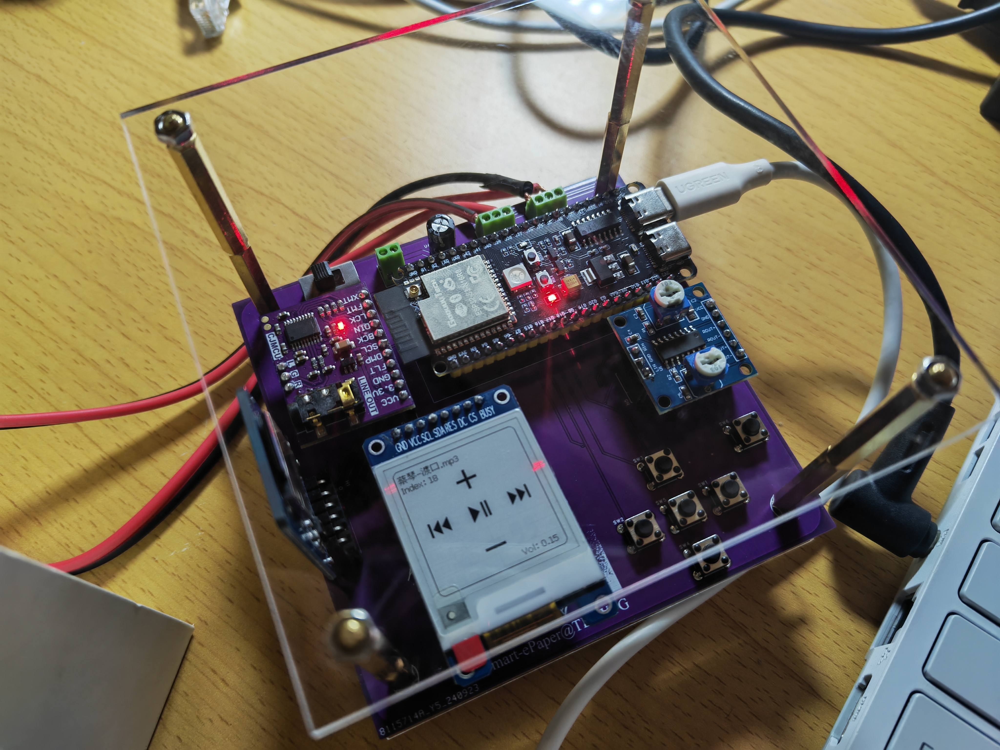
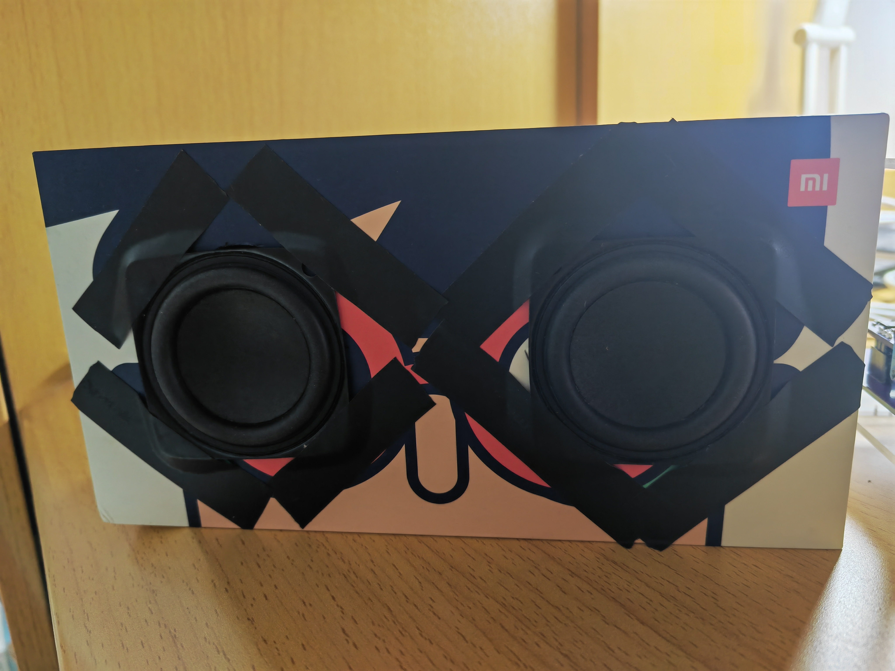
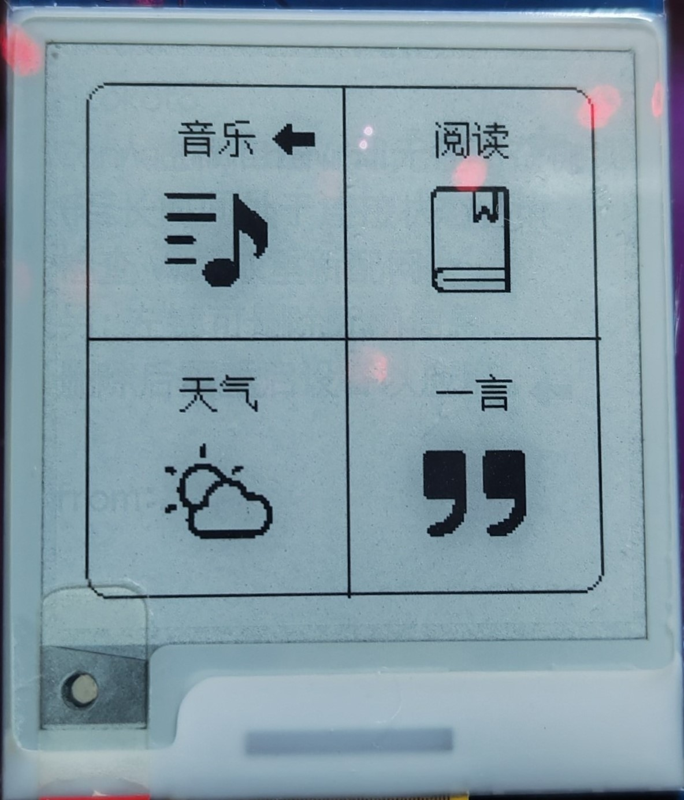
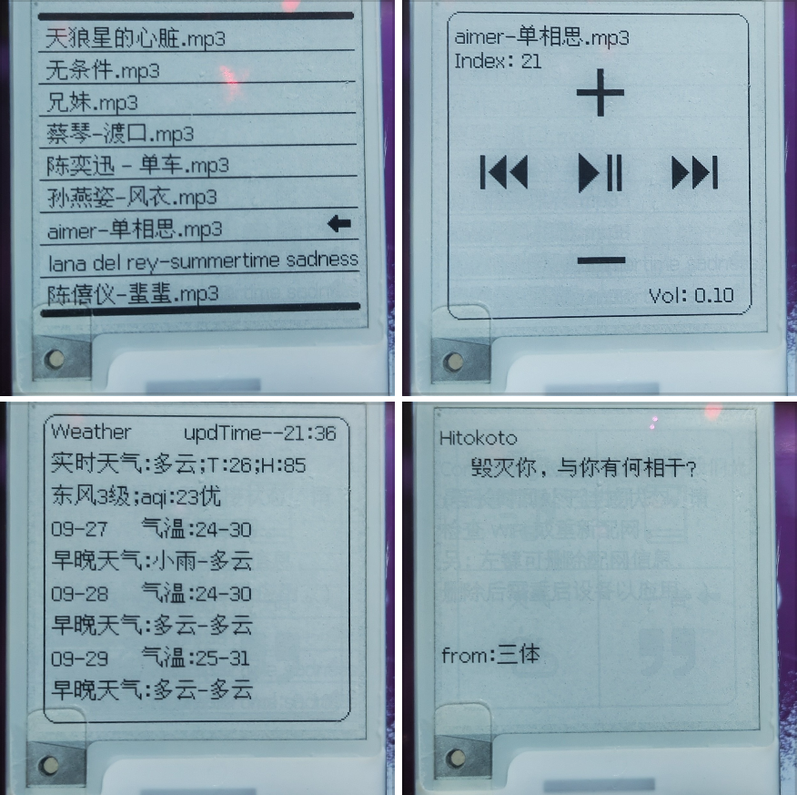

# Smart-ePaper

An ePaper MP3 player with WiFi, based on ESP32-S3 and Arduino.

一个基于 ESP32-S3 主控和 Arduino 框架的联网墨水屏 MP3。

> Smart-ePaper 测试板的 PCB 设计见 docs 文件夹，其中 Smart-ePaper-TestBoard.eprj 可用嘉立创 EDA(专业版) 打开。
>
> 另外，用于显示的 bitmap 和取模规则见 docs/bmp 文件夹。

* **实物图**
  
  

点击展开

    
  

  
  
  

* **功能展示**

  

点击展开

    
  

  
  
  

* **音响效果**

  

点击展开

    
  → [bilibili 链接](https://www.bilibili.com/video/BV1JnxwetEhW)
  
  

## Hardware and Software

* **Board**: ESP32-S3-WROOM-1-N16R8
* **Framework**: Arduino (PlatformIO IDE)
* **Other Hardware Components**:
  * 1.54-inch 200x200 e-paper display (ZJY200200-0154DAAMFGN, driver: SSD1681)
  * PCM5102 (DAC)
  * PAM8406 (功放)
  * 某 2 寸发烧 4Ω5W HiFi 喇叭
  * MicroSD Card Adapter (SPI, support 32GB SDHC)
* **Libraries**
  * **Arduino Lib**:
    * [zinggjm/GxEPD2](https://github.com/ZinggJM/GxEPD2)@^1.5.8
      * depends: [adafruit/Adafruit_BusIO](https://github.com/adafruit/Adafruit_BusIO)@^1.16.1, [adafruit/Adafruit-GFX-Library](https://github.com/adafruit/Adafruit-GFX-Library)@^1.11.10
    * [olikraus/U8g2_for_Adafruit_GFX](https://github.com/olikraus/U8g2_for_Adafruit_GFX)@^1.8.0
    * [bblanchon/ArduinoJson](https://github.com/bblanchon/ArduinoJson)@^7.1.0
    * [greiman/SdFat](https://github.com/greiman/SdFat)@^2.2.3
  * **Extra Lib**:
    * [ArduinoUZlib](https://github.com/tignioj/ArduinoUZlib)
    * [arduino-audio-tools](https://github.com/pschatzmann/arduino-audio-tools)@^0.9.8
    * [arduino-libhelix](https://github.com/pschatzmann/arduino-libhelix)@^0.8.5

  > 以上库也已打包为 libraries.zip，放在了 release 里。

## Pin Assignments

> You can refer to projects in the "Tests" folder to modify the pins yourself.

* **ePaper**
  
  | Function | Pin |
  |----------|-----|
  | CS       | G10 |
  | MOSI/SDA | G11 |
  | // MISO  | G13 |
  | SCK/SCL  | G12 |
  | DC       | G8  |
  | RST      | G7  |
  | BUSY     | G9  |

* **PCM5102**
  
  | Function | Pin  |
  |----------|------|
  | BCK      | G6   |
  | WS/LCK   | G4   |
  | DIN      | G5   |
  | FMT      | GND  |
  | XMT      | 3.3V |

  > Optional Pins
  > 
  >   * **DMP** - De-emphasis control for 44.1kHz sampling rate(1): Off (Low) / On (High)
  >
  >   * **FLT** - Filter select : Normal latency (Low) / Low latency (High)
  >
  >   * **SCL** (left floating is ok) - System clock input (probably SCL on your board).
  >
  >   * **FMT** - Audio format selection : I2S (Low) / Left justified (High)
  >
  >   * **XMT** - Soft mute control(1): Soft mute (Low) / soft un-mute (High)

* **MicroSD Card Adapter**
  
  | Function | Pin |
  |----------|-----|
  | SCK      | G40 |
  | MISO     | G42 |
  | MOSI     | G41 |
  | SS       | G39 |

* **Tact Switch**
  
  > Pin --> Switch --> GND

  | Function         | Pin |
  |------------------|-----|
  | next,right       | G15 |
  | previous,left    | G16 |
  | volumeH,up       | G17 |
  | volumeL,down     | G18 |
  | startStop,enter  | G47 |
  | back,clearScreen | G2  |

## Notes

* 对于 SdFat 库，需要将其 SdFatConfig.h 中的宏定义 `USE_UTF8_LONG_NAMES` 的值改为 1，才能正常读取中文路径。
* 电源不稳定时（比如我的电脑在插电状态下的 USB 供电），DAC 效果极差，同时也会导致 SD 卡读取异常。
* 某些 SD 卡读写模块虽然标 3.3~5V，但实际上一定要接 5V 才能正常使用。
* 测试结束后，将日志的级别设为 `AudioLogger::Warning` 或 `AudioLogger::Error` 以提高音质。
* 配网相关操作见屏幕提示（连接热点“myESP32_AP”，然后在强制门户中输入 WiFi 名和密码）。
* 若要使用天气功能，需在 Weather.h 中填入[和风天气](https://dev.qweather.com/) APIKEY。(免费订阅版本)

## Functional Tests

> Pre-integration functional testing.
>
> The term "Extra Lib" refers to PIO's "project specific (private) libraries.", which are not included in "platformio.ini".

1. **Smart-ePaper_screenTest**

    * Arduino Lib: GxEPD2

2. **Smart-ePaper_GB2312Test**

    * Arduino Lib: GxEPD2, U8g2_for_Adafruit_GFX

3. **Smart-ePaper_HTTPTest**

    * Arduino Lib: ArduinoJson
    * Extra Lib: ArduinoUZlib

4. **Smart-ePaper_AudioTest**
    
    * Extra Lib: arduino-audio-tools

5. **Smart-ePaper_SDTest**
    
    * Arduino Lib: SdFat

6. **Smart-ePaper_MemoryMP3Test**

    * Extra Lib: arduino-audio-tools, arduino-libhelix

7. **Smart-ePaper_SDMP3Test**

    * Arduino Lib: SdFat
    * Extra Lib: arduino-audio-tools, arduino-libhelix

8. **Smart-ePaper_MP3PlayerTest**

    * Arduino Lib: SdFat
    * Extra Lib: arduino-audio-tools, arduino-libhelix

> Reader 咕咕了，个人觉得实用性较差（）不过还是在代码中保留了相关接口。

## License

This project is licensed under the MIT license. External libraries used by Smart-ePaper are licensed under their own licenses.
